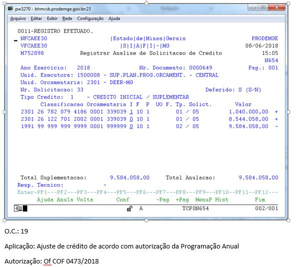
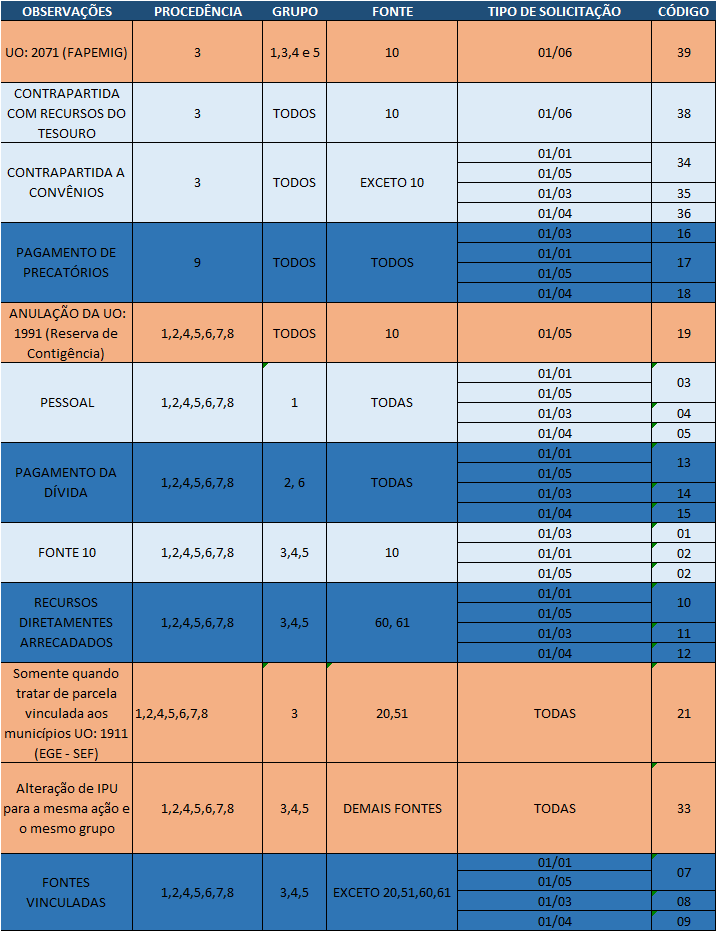

# Como Elaborar Solicitações Autorizadas

## Exemplo de Solicitação Autorizada

Na Figura 1 temos um exemplo de como a solicitação autorizada deve ser armazenada para que o Núcleo de Gestão Orçamentária elabore o decreto. 

**Figura 1:** Exemplo de Solicitação Armazenada pelo Setorialista




**Fonte:** SCPPO

## Passos para a Elaboração - Roteiro Geral
1. [ ] Tirar print da tela do SIAFI e colar no documento
1. [ ] Registrar Operação de Crédito (OC)
	1. [ ] Consultar Quadro da Operação de Crédito na seguinte ordem
		1. [ ] Observações
		1. [ ] Procedência
		1. [ ] Grupo
		1. [ ] Fonte
		1. [ ] Tipo de Solicitação
		1. [ ] Registrar o código
1. [ ] Escrever a aplicação
1. [ ] Escrever a Autorização
1. [ ] Escrever texto de inciso do Decreto (Caso seja Excesso ou Superávit)


## Passos para a Elaboração - Roteiro Específico

Nesta seção, objetivamos descrever algumas etapas (as mais "complexas") detalhadamente 

### Registrar Operações de Crédito 
Até esse momento os seguintes passos já devem ter sido cumpridos:

1. [x] Tirar print da tela do SIAFI e colar no documento
1. [ ] Registrar Operação de Crédito (OC)
	1. [ ] Consultar Quadro da Operação de Crédito na seguinte ordem
		1. [ ] Observações
		1. [ ] Procedência
		1. [ ] Grupo
		1. [ ] Fonte
		1. [ ] Tipo de Solicitação
		1. [ ] Registrar o código
1. [ ] Escrever a aplicação
1. [ ] Escrever a Autorização
1. [ ] Escrever texto de inciso do Decreto (Caso seja Excesso ou Superávit)

Para efetuar o registro da OC deve-se obsevar o Quadro 1 seguindo a ordem proposta no Checklist

**Quadro 1:**Critérios para a OC



**Fonte**:Tabela para Técnicos SCPPO, Elaboração dos Autores

#### Exemplo

Suponha a seguinte classificação orçamentária 

```
  2101 18 541 143 4380 0001 339035 0 61 1        01 / 04           213.377,00  +
```

Pelos critérios estabelecidos na checklist, temos: 

|  Critério  | Correspondente |
| :-------:  | :------------: |
| Observação | Recursos Diretamente Arrecadados |
| Procedência | 1 |
| Grupo | 3 | 
| Fonte | 61 |
| Tipo de Solicitação | 01/04 |
| Registro de Código | 12 |

Logo, podemos concluir que o código é o 12

### Escrever Texto de Inciso para o Decreto
Até esse momento os seguintes passos já devem ter sido cumpridos:

1. [x] Tirar print da tela do SIAFI e colar no documento
1. [x] Registrar Operação de Crédito (OC)
	1. [x] Consultar Quadro da Operação de Crédito na seguinte ordem
		1. [x] Observações
		1. [x] Procedência
		1. [x] Grupo
		1. [x] Fonte
		1. [x] Tipo de Solicitação
		1. [x] Registrar o código
1. [x] Escrever a aplicação
1. [x] Escrever a Autorização
1. [ ] Escrever texto de inciso do Decreto (Caso seja Excesso ou Superávit)

O texto de inciso que vai posteriormente ser utilizado para os incisos dos decretos deve seguir algumas regras 

#### Boas Práticas para a Escrita do Decreto 

* Nome da receita com iniciais em maiúsculo (exemplo: receita de Recursos Diretamente Arrecadados com Vinculação Específica);
* Valor escrito junto ao R$ (exemplo errado: R$ 13.000.000,00; exemplo correto: R$13.000.000,00);
* Valor escrito por extenso sem vírgulas e sem “e” entre os milhões, milhares e centenas (exemplo errado 1: oito milhões, setecentos e setenta e dois mil e quarenta e oito reais; exemplo errado 2: oito milhões e setecentos e setenta e dois mil e quarenta e oito reais; exemplo correto: (oito milhões setecentos e setenta e dois mil quarenta e oito reais);

> 
**DICA:** O site https://4devs.com.br/numero_por_extenso escreve o número por extenso, mas atenção para o “e” entre os milhões, milhares e centenas.

* Não colocar abreviações;
* Finalizar inciso com ponto e virgula (;). 
