# Elaboração da Nota no SISOR

A nota do Decreto é um dos documentos que compõem o processo de elaboração e sua importância é extrema visto que apresenta um resumo de todas as operações inseridas na minuta com o detalhamento de finalidade/aplicação, valor, fonte de recurso, Unidade Orçamentária, procedência e Grupo. 

Para elaborar a nota é preciso acessi ao SISOR. Segue abaixo passo a passo para a sua elaboração

## Registro das Solicitações Autorizadas com número do SISOR 
- Entre no site https://wwws.orcamento.mg.gov.br/aoad/ e preencha seu login e senha 

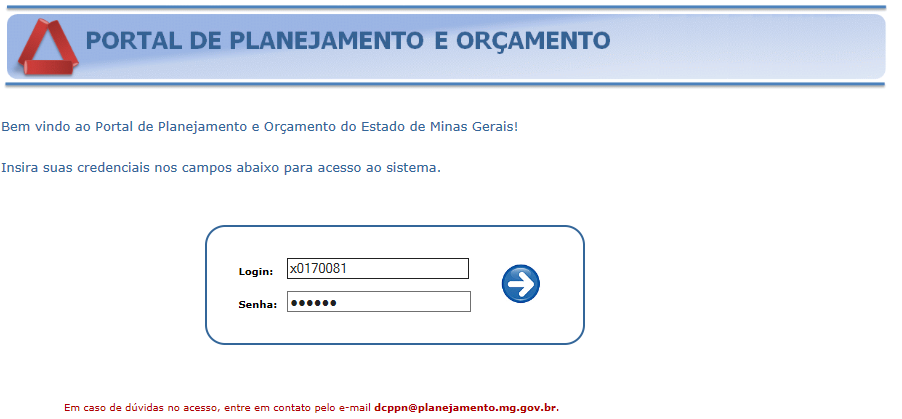

>
**Lembrete:** O login e a senha são os mesmo do SIAFI

- Na próxima tela selecione o sistema orçamentário 9203 – SEPLAG – SCPPO – DCMEFO – GERAL ... e clique em alterações orçamentárias 

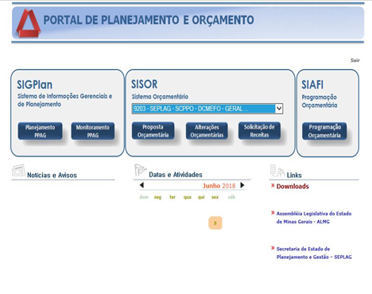

- Na tela que abrir procure na aba a esquerda *Relatório de Solicitações*

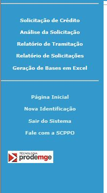

- No quadro *Qual relatório deseja extrair?* clique em Nota para Decreto

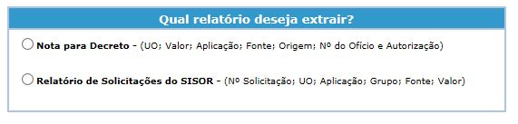

- No quadro *Relatório Nota do Decreto* insira o código das Solicitações, presente nas Solicitações Autorizadas armazenada pelos setorialistas, e clique em *Incluir na Lista*
	- Após inserir todas as solicitações clique em *Gerar Nota*

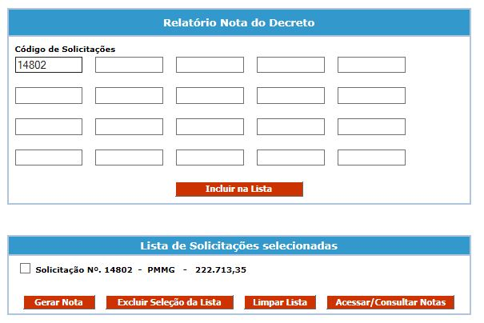

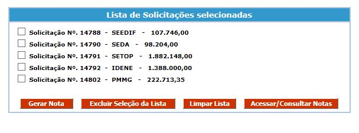

> 
IMPORTANTE: Só pode inserir um número de SISOR por vez

- Na janela Geração de Nota para Decreto insira as Informações:
	- N° da Minuta SIAFI
	- Data
	- Clique em *Salvar*

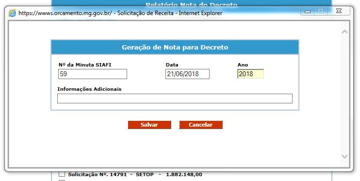

## Registro das Solicitações Autorizadas sem número do SISOR 

- Clique no botão *Incluir Solicitação* para inserir as solicitações sem número de SISOR

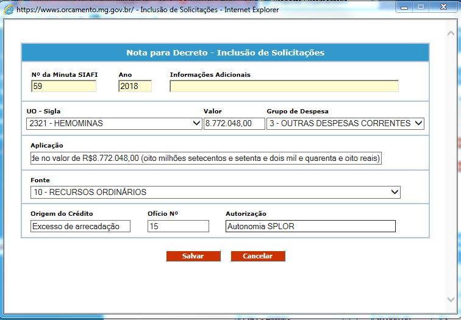

- Preencha os seguintes campos com as informações das solicitações 
	- UO Sigla
	- Valor
	- Grupo de Despesa
	- Aplicação
	- Fonte
	- Origem do Crédito
	- Ofício n°
	- Autorização 

>
O número do Ofício deve começar com -e em cada nova solicitação a ser inclusa adiciona mais uma unidade

## Correção das Autorizações em Análise
Algumas solicitações estarão com a Autorização *Em Análise*, para corrig-lás execute os seguintes passos 
- Clique no "caderninho" do lado direito 

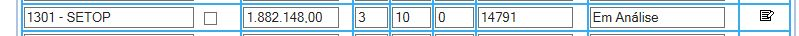

- Preencha o campo *Autorização* com a autorização presente na nota e clique em *Salvar* 

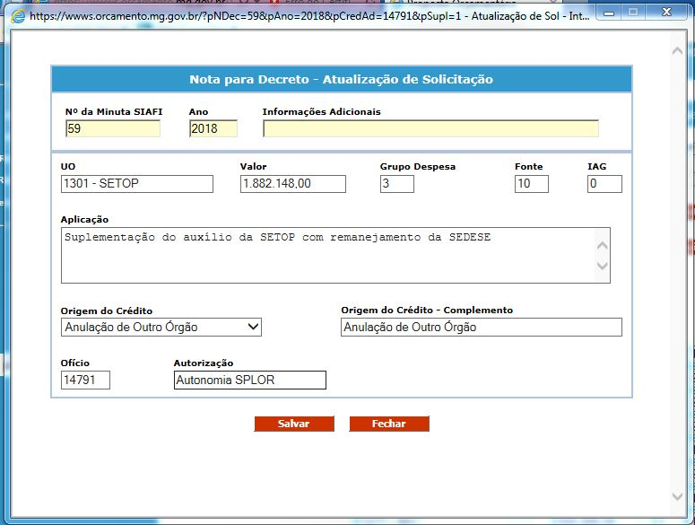

## Inserir Autorizações com número do SISOR 
Algumas vezes esquecemos de colocar solicitações com número do SISOR ou os setorialistas colocam as solicitações depois que começamos a fazer, para adiciona-las basta seguir os passos abaixo: 
- Clique em *Incluir Solicitações SISOR*
- Na janela *Nota para Decreto - Inclusão de Solicitações SISOR* preencha o campo *N° da Solicitãção* e clique em Salvar

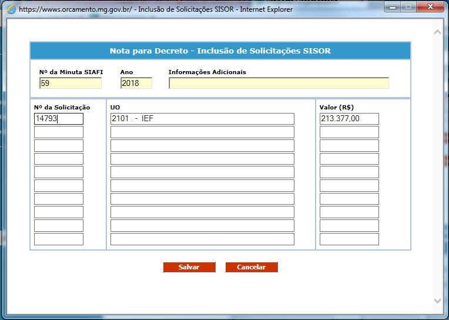

>
**ATENÇÃO:** Só pode inserir uma solicitação por vez 

### Salvar e Gerar Nota

Após todos os passos anteriores realizados devemos slavar a nota e gera-la para uso posterior, conforme o passo a passo abaixo: 

- Clique em **Salvar** e um erro será exibido na pagina. 

- Clique em **Imprimir** e uma nova pagina ira abrir. Va ao fina da página e clique no disquete. 

