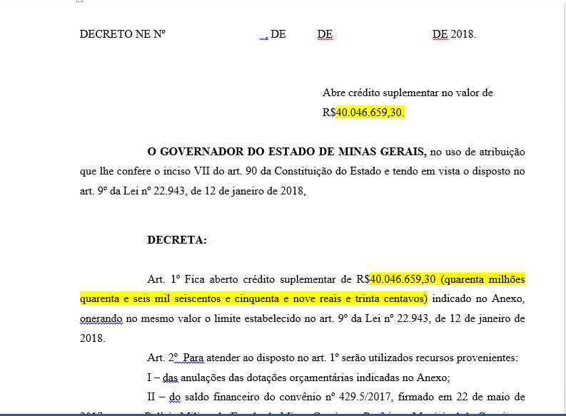

# Confecção da Minuta do Decreto 
Nesta seção veremos como fazer a confecção da Minuta do Decreto

## Roteiro Geral 
1. [ ] Pegar Minuta de Decreto anterior 
1. [ ] Mudar valores da suplementação 
1. [ ] Copiar e colar incisos 
	1. [ ] Revisar escrita dos incisos
1. [ ] Copiar e Colar Nota do SIAFI
	1. Formatar Nota do SIAFI no documento
	1. Corrigir erros ortográficos 
1. [ ] Revisar Minuta do Decreto 

## Roteiro Específico 

###  Pegar Minuta de Decreto anterior
1. Abra a pasta de Minutas Finalizadas (S:\4.Execução Física e Orçamentária\DCMEFO\2018\2. Núcleo de Gestão Orçamentária\1. Decretos\02. Minutas Finalizadas)
1. Verifique o número da última minuta 
1. Crie uma pasta com o número da minuta atual (última + 1)
1. Vá na pasta da última minuta e copie a minuta de decreto 
1. Cole na pasta da minuta atual e renomeie 

###  Mudar Valores da Suplementação
De posse da minuta verifique os valores de suplementação e os altere para o valor da suplementação atual, os trechos em destque da figura baixo são os que devem ser alterados:

**Figura 1:** Alteração dos valores de suplementação 

**Fonte:** SCPPO 

###  Copiar e Colar Incisos 
1. Apague os incisos presentes na minuta (incisos da minuta anterior)
1. Substitua pelos incisos das solicitações colocadas pelos setorialistas 

>
**IMPORTANTE:** Não esqueça de revisar os incisos segundo as boas práticas disposta na *Solicitação* desse mesmo manual 

>
**IMPORTANTE:** Caso os incisos tenham o mesmo contrato utilizado da mesma operação orçamentária deve-se somar os incisos 

###  Copiar e Colar Nota do SIAFI 

####  Retirar Nota do SIAFI
1. Vá para o endereço https://www.siafi.mg.gov.br/fcag/SIAFI/site_siafi_mg/relatorio (no internet explorer)
1. Preencha a tela de Login
	1. Usuário
	1. Senha
	1. Unidade Executora: 1500008
	1. Ano de Exercício
1. Clique em Continuar
1. Relatorios da Sucor
1. Minutas de Decretos - MINUTAS
1. Na lupa do lado direito insira o número da minuta e aperte *ENTER*
1. Salve a minuta no computador 

####  Formatar a Nota do SIAFI 
1. Vá ao final do documento da minuta e localize o *ANEXO*
1. Apague todo o texto após ele 
1. copie e cole o texto da Nota do SIAFI 
1. Selecione todo o texto colado 
	1. Coloque tudo em minúsculo
	1. Alinhe a esquerda
	1. Alinhe ao centro
	1. Alinhe a direita
	1. Alinhe ao centro
	1. Alinhe a esquerda
1. Vá na aba *Revisão* e clique em *Ortografia e Gramática*
1. Corrija os erros de grámatica
1. Coloque tudo em maiúsculo 
1. Revise o texto retirando os espaços entre as linhas e os cabeçalhos no meio do texto 

>
**ATENÇÃO:** Algumas palavras como pública e alguns órgãos estão incompletos ou com a escrita errada, corrija-os durante a revisão
