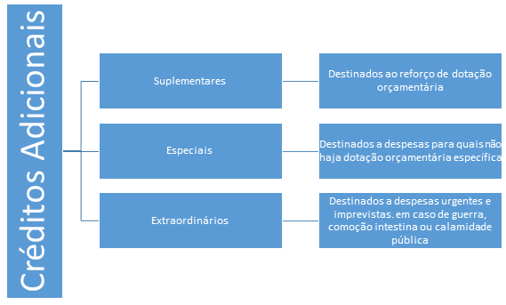

# Decreto Orçamentário

## Objetivo
O presente manual visa fornecer passo a passo do processo de confecção de um decreto para abertura de créditos adicionais.

## Introdução
Existe alguns casos que Lei Orçamentária Anual (LOA), durante seu exercício financeiro, necessita de recursos que não foram previstos na sua elaboração. Nesse contexto, o Poder Executivo pode realizar remanejamentos, transposições e créditos adicionais, conforme definido no Art. 40 da Lei Federal 4320/64 que, segundo o caput, *“Estatui Normas Gerais de Direito Financeiro para elaboração e contrôle dos orçamentos e balanços da União, dos Estados, dos Municípios e do Distrito Federal”.*

>
Art 40. São créditos adicionais, as autorizações de despesa não computadas ou insuficientemente dotadas na Lei de Orçamento.

No artigo 41 da lei supracitada é definido quais são os créditos adicionais, vide Figura 1. 

**Figura 1:**Classificação dos Créditos Adicionais 

**Fonte:**Lei 43206/64, Elaboração dos Autores

Ainda na mesma lei, no artigo 42 tem-se que:  

>
Art. 42. Os créditos suplementares e especiais serão **autorizados por lei e abertos por decreto executivo**.

Destaca-se a necessidade da lei para abertura dos créditos suplementares e especiais. Neste sentido, surge a LOA que define o limite da alteração orçamentária fiscal. Como exemplo tem-se o artigo 9° da Lei 22943 de 12 de janeiro de 2018 (LOA para o exercício de 2018). 

>
Art. 9º – Fica o Poder Executivo autorizado a abrir créditos suplementares ao seu orçamento fiscal até o limite de 40% (quarenta por cento) da despesa fixada no art. 2º. 

## Processo 
1. Confecção de Solicitações Autorizadas
1. Registro e Nota do SISOR
1. Registro no SIAFI 
	1. Conferência dos Valores da Nota com o SIAFI
1. Confecção do Decreto
	1. Conferência dos incisos com os Valores do SIAFI
